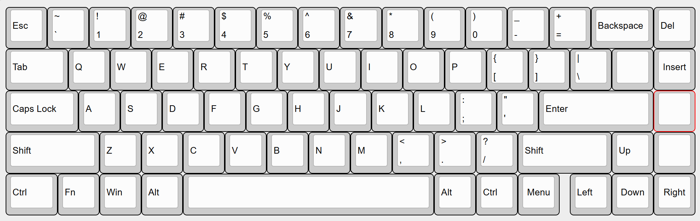

## 6/4 - Started project
time spent: 2 hours

Looking online for inspiration/advice!\
r/MechanicalKeyboards, r/ErgoMechKeyboards\
https://www.keyboard.university/100-courses \
Kailh Choc low profile switches/keycaps \
[https://keeb.io/products/kailh-choc-low-profile-switches-v1?variant=40343496228958](https://keeb.io/collections/low-profile-choc?srsltid=AfmBOormzYB7J0lcD82984ZFZuBkuCTdCO0rUvQoWA8rn4cxV5GyzAOq)\
Raspberry Pi Pico MCU

Possible features to look into?\
75% or 65% layout?\
Bluetooth
 
Still a work in progress. Next time I need to figure out the keyboard layout & start working on the PCB schematic.

## 6/26 Creating the layout
time spent: 2 hours

I used https://www.keyboard-layout-editor.com/#/ to create a reference for creating the schematic:

Since I went with a staggered layout, I used https://www.keyboard.university/100-courses/keyboard-sizes-layouts-gdeby to help find common keycap sizes, but I will likely have to make changes to this later when I find a keycap set. I saved the .json file so I can modify the layout later.

switches needed: 70\
row 0: 15\
row 1: 16\
row 2: 14\
row 3: 14\
row 4: 11

layout references\
https://kbdfansmds-com.myshopify.com/products/tada68-mechanical-keyboard-65-iso-layout \
https://www.reddit.com/media?url=https%3A%2F%2Fi.redd.it%2Flbyp0emddot81.jpg

## 6/27
time spent: 

Footprints\
https://github.com/daprice/keyswitches.pretty/tree/master\
https://github.com/ncarandini/KiCad-RP-Pico
